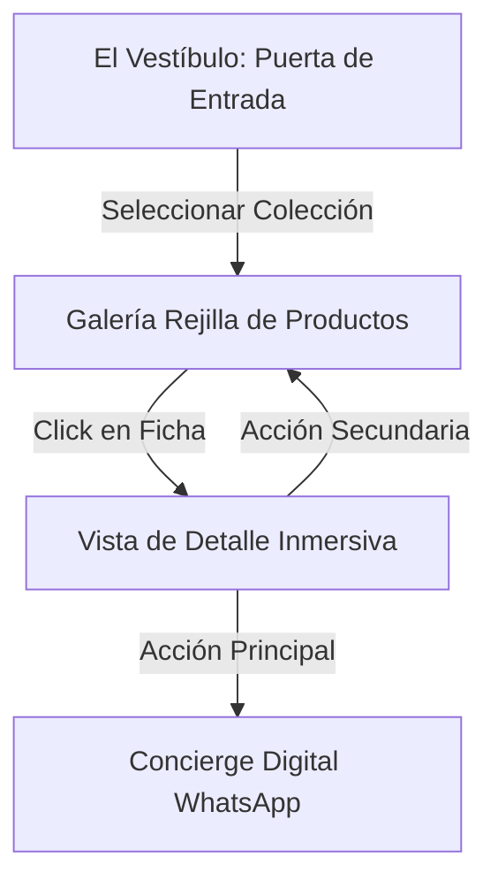

# Propuesta de Rediseño de UX: Catálogo de Rejilla Editorial & Vista de Detalle (Silencio Mineral)

Este documento detalla la reestructuración del flujo de experiencia de usuario (UX) para equilibrar la estética inmersiva "Slow Shopping" con la usabilidad necesaria para manejar colecciones extensas (de hasta cientos de productos).

---

## 1. Análisis de Usabilidad y Nueva Propuesta de Navegación

### El Problema del Deslizador Individual (Lookbook Uniplato)
Mostrar una sola pieza a la vez es idóneo para colecciones ultra-exclusivas de 5 a 10 productos. Sin embargo, para un catálogo extenso, obliga al visitante a hacer clic repetidamente, causando fatiga de navegación.

### La Solución: "La Galería Editorial"
Proponemos un diseño híbrido que conserva el tono poético y el minimalismo de la marca, pero adopta una estructura de **Galería en Rejilla (Grid)** y **Ficha de Detalle dedicada**.

---

## 2. Nueva Estructura Visual y UX

### A. El Catálogo (Galería Rejilla)
- **Diseño de Rejilla Asimétrica:** Un grid de 2 o 3 columnas de estilo editorial (tipo revista de moda *Kinfolk* o *Cereal*), muy espacioso, con abundante espacio en blanco para que las piezas respiren.
- **Microinteracciones en Tarjeta:** 
  - Al posar el mouse (*hover*) sobre la foto de una pieza, la imagen cambia suavemente a un macro-detalle (o reproduce el micro-video en bucle de 3 segundos), activando de forma muy sutil un susurro acústico de roce de tela.
  - La información de nombre y precio se muestra en tipografía minimalista de tamaño pequeño.

### B. La Vista de Detalle (Ficha Inmersiva)
Al hacer clic en una pieza de la rejilla, la pantalla transita de forma fluida (usando `framer-motion`) a una vista a pantalla completa dividida en dos:
- **Lado Izquierdo (Poética y Acción):** 
  - Nombre grande de la pieza.
  - El copywriting poético y melancólico destacando la relación de la luz con la materia.
  - Precio discreto y estado de taller.
  - Botón prominente de consulta al Concierge de WhatsApp.
  - Botón minimalista de "Volver al Catálogo" que reproduce el sonido de paso de página.
- **Lado Derecho (Exhibición Sensorial):**
  - Galería de fotos macro de alta resolución y videos en bucle.
  - El usuario puede navegar los detalles visuales de la pieza.

---

## 3. Cambios en los Componentes del Frontend

### [MODIFY] [Lookbook.jsx](file:///C:/Users/herbe/Desktop/tienda/src/components/Lookbook.jsx)
- Reestructurar el componente para soportar dos estados internos:
  1. `selectedProduct === null`: Renderiza la rejilla editorial de todos los productos de la colección (`boutique` o `joyeria`). Incluye filtros sutiles.
  2. `selectedProduct !== null`: Renderiza la vista de detalle a pantalla dividida para la pieza seleccionada.
- Integrar transiciones fluidas de entrada y salida entre la rejilla y el detalle.

### [MODIFY] [index.css](file:///C:/Users/herbe/Desktop/tienda/src/index.css)
- Añadir clases de rejilla de diseño editorial `.editorial-grid` y de tarjeta de producto `.product-card`.
- Diseñar efectos de transición de escala y superposición de fotos para el hover de las tarjetas.

---

## 4. Plan de Verificación

### Manual
- Probar que la rejilla cargue instantáneamente y responda de forma fluida en pantallas de móvil (pasando a 1 o 2 columnas) y escritorio.
- Verificar que al dar clic en un producto la animación hacia el detalle sea instantánea y táctil.
- Probar el flujo de regreso a la rejilla conservando la posición de scroll del usuario.
